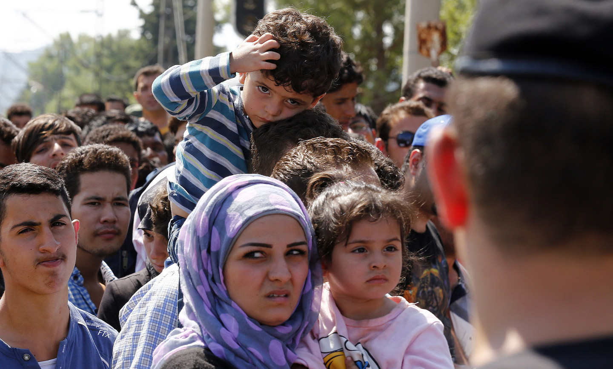

<!-- .element: width="25%" -->
# Germany Says Welcome

---

# Wer?

----

     Foto: Aleander Hundenborn

Note: 7 up to 18, 5 > 18

---

# Warum?

----

## Zugänglichkeit

Note: - viele haben Smartphone für Kontakt in die Heimat, Informationen, Navigation auf Fluchtroute
- immer mehr Internetcafes in Unterkünften
- einfaches CMS
- APIs für automatische Datenpflege

----

## Einfachheit

Note: - Github (jeder kann mitcoden)
- Community
	- wenige Helfer lokal pro Ort, Helfer aus ganz Deutschland im Netz

----

    <a href="https://flic.kr/p/ykP9eF">CC-BY 4.0 Google Material Icons</a>

Note: Freifunk, Refugee Emancipation

---

## Was wird gebraucht?
## Wann wird es gebraucht? <!-- .element: class="fragment" data-fragment-index="1" -->
Note: we asked us

----

## Was wird gebraucht?

### Information <!-- .element: class="fragment" data-fragment-index="1" -->
### Antworten <!-- .element: class="fragment" data-fragment-index="2" -->
### Kommunikation <!-- .element: class="fragment" data-fragment-index="3" -->
Note: ww thought about

----

### Features

    <a href="https://flic.kr/p/zTdzzJ">CC-BY 4.0 Jugend hackt, Foto: Leonard Wolf</a>

----

#### FAQ

----

#### Map

Note: Wichtige Punkte, wifi-hotspots, wichtige behörden, krankenhäußer, apotheken, etc

----

#### Phrasebook

---

## Stufen nach dem Betreten von Deutschland

----

### Ankunft

<!--

    <a href="https://flic.kr/p/wTdTeN">CC BY Foto: Dragan Tatic</a>

-->

Note: medizinische Erstversorgung, Kontakt zu Familie und Freunden

----

### Warten auf Entscheidung

Note: Bildung, Sprache, Ämter

----

### Integration

Note: Praktika/arbeit, sprachkurse, soziale kontakte

---

# Wie?

----

## Website
## App <!-- .element: class="fragment" data-fragment-index="1" -->
## Admin Panel <!-- .element: class="fragment" data-fragment-index="2" -->
## Backend <!-- .element: class="fragment" data-fragment-index="3" -->

---

## Backend

---

## Website

---

## App

 <!-- .element: width="35%" -->

----

<!-- .element: width="35%" -->

----

<!-- .element: width="35%" -->

----

<!-- .element: width="35%" -->

----

<!-- .element: width="35%" -->

---

## Admin Panel

 <!-- .element: width="100%" -->

----

# Content Management System

Note: User friendly piece of software, to add and edit content

----

 <!-- .element: width="100%" -->

---

## Kontakt

[germany-says-welcome.de](http://germany-says-welcome.de)

[info@germany-says-welcome.de](mailto://info@germany-says-welcome.de)

