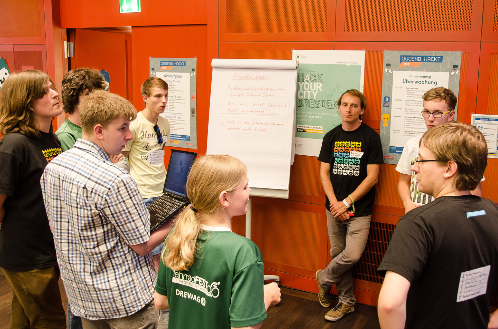
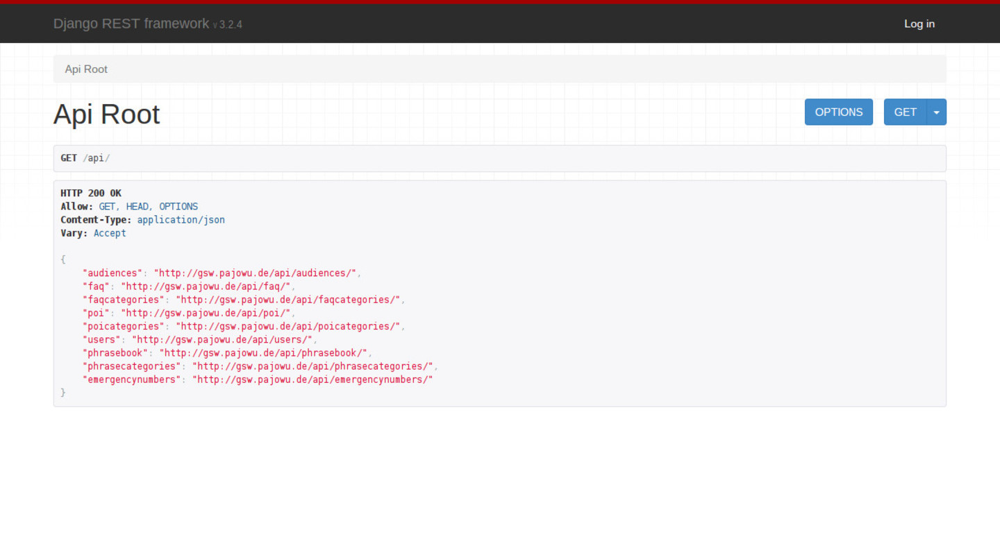

<!-- .element: width="25%" -->
# Germany Says Welcome

---

# Who?

----

<p></p>
<p style="font-style:italic;align:bottom;position:absolute;right:0;bottom:0;font-size:small;">
     Foto: Aleander Hundenborn
</p>
Note: 7 up to 18, 5 > 18

----


<p style="font-style:italic;align:bottom;position:absolute;right:0;bottom:0;font-size:small;">
    <a href="https://flic.kr/p/zBJe8W">CC-BY 4.0 Jugend hackt, Foto: Leonard Wolf</a>
</p>
Note: Found together during jugend hackt hackathon

----

<p></p>
Note: JH is organised by th Open Knowledge Foundation Germany

----


<p style="font-style:italic;align:bottom;position:absolute;right:0;bottom:0;font-size:small;">
    <a href="https://flic.kr/p/zS3tSb">CC-BY 4.0 Jugend hackt, Foto: Leonard Wolf</a>>
</p>
Note: throw 60-150 People in one place and give them

----


<p style="font-style:italic;align:bottom;position:absolute;right:0;bottom:0;font-size:small;">
    <a href="https://flic.kr/p/zUkTy2">CC-BY 4.0 Jugend hackt, Foto: Leonard Wolf</a>
</p>
Note: Time to find ideas

----


<p style="font-style:italic;align:bottom;position:absolute;right:0;bottom:0;font-size:small;">
    <a href="https://flic.kr/p/yBnddS">CC BY 3.0 Jugend hackt, Foto: Eva-Maria Kühling/Peter Wozniak</a>
</p>
Note: Food

----


<p style="font-style:italic;align:bottom;position:absolute;right:0;bottom:0;font-size:small;">
    <a href="https://flic.kr/p/xzXjzo">CC BY 3.0 Jugend hackt, Foto: Eva-Maria Kühling/Peter Wozniak</a>
</p>
Note: To code cool and

----


<p style="font-style:italic;align:bottom;position:absolute;right:0;bottom:0;font-size:small;">
    <a href="https://flic.kr/p/zBLtuA">CC-BY 4.0 Jugend hackt, Foto: Leonard Wolf</a>
</p>
Note: create cool stuff

----


<p style="font-style:italic;align:bottom;position:absolute;right:0;bottom:0;font-size:small;">
    <a href="https://flic.kr/p/zUkUVF">CC-BY 4.0 Jugend hackt, Foto: Leonard Wolf</a>
</p>
Note: and sometimes hate their computer

---

# What?

----


<p style="font-style:italic;align:bottom;position:absolute;right:0;bottom:0;font-size:small;">
    <a href="https://flic.kr/p/wTdTeN">CC BY Foto: Dragan Tatic</a>
</p>
Note: saw pictures of refugees

----


<p style="font-style:italic;align:bottom;position:absolute;right:0;bottom:0;font-size:small;">
    <a href="https://flic.kr/p/zTeg5f">CC-BY 4.0 Jugend hackt, Foto: Leonard Wolf</a>
</p>
Note: not the best social workers, but we have

----


<p style="font-style:italic;align:bottom;position:absolute;right:0;bottom:0;font-size:small;">
    <a href="https://flic.kr/p/ue1KEf">CC BY-SA 2.0 Jugend hackt, Foto: Steffen Haas</a>
</p>
Note: ideas

----


<p style="font-style:italic;align:bottom;position:absolute;right:0;bottom:0;font-size:small;">
    <a href="https://flic.kr/p/ue1H8w">CC BY-SA 2.0 Jugend hackt, Foto: Steffen Haas</a>
</p>
Note: fun

----


Note: and time

---

# Why?

----

## Accessibility

Note: - viele haben Smartphone für Kontakt in die Heimat, Informationen, Navigation auf Fluchtroute
- immer mehr Internetcafes in Unterkünften
- einfaches CMS
- APIs für automatische Datenpflege

----

## Easyness

Note: - Github (jeder kann mitcoden)
- Community
	- wenige Helfer lokal pro Ort, Helfer aus ganz Deutschland im Netz

----


<p style="font-style:italic;align:bottom;position:absolute;right:0;bottom:0;font-size:small;">
    <a href="https://flic.kr/p/ykP9eF">CC-BY 4.0 Google Material Icons</a>
</p>

Note: Freifunk, Refugee Emancipation

---

## What is needed?
## When is it needed? <!-- .element: class="fragment" data-fragment-index="1" -->
Note: we asked us

----

## What is needed?

### Information <!-- .element: class="fragment" data-fragment-index="1" -->
### Answers <!-- .element: class="fragment" data-fragment-index="2" -->
### Communication <!-- .element: class="fragment" data-fragment-index="3" -->
Note: ww thought about

----

### Features


<p style="font-style:italic;align:bottom;position:absolute;right:0;bottom:0;font-size:small;">
    <a href="https://flic.kr/p/zTdzzJ">CC-BY 4.0 Jugend hackt, Foto: Leonard Wolf</a>
</p>

----

#### FAQ


----

#### Map


Note: Wichtige Punkte, wifi-hotspots, wichtige behörden, krankenhäußer, apotheken, etc

----

#### Phrasebook


---

## Stages after entering Germany

----

### Arrival

<!--
<p style="font-style:italic;align:bottom;position:absolute;right:0;bottom:0;font-size:small;">
    <a href="https://flic.kr/p/wTdTeN">CC BY Foto: Dragan Tatic</a>
</p>-->

Note: medizinische Erstversorgung, Kontakt zu Familie und Freunden

----

### Asylumrequest

Note: Bildung, Sprache, Ämter

----

### Integration

Note: Iternships / work, speech courses, social contacts

---

# How?

----

## Website
## App <!-- .element: class="fragment" data-fragment-index="1" -->
## Admin Panel <!-- .element: class="fragment" data-fragment-index="2" -->
## Backend <!-- .element: class="fragment" data-fragment-index="3" -->

---

## Backend



----


----


"The web framework for perfectionists with deadlines."

Note: easy to develop, secure, scalable

----


Note: implements json rest api to django

----

## REST

## Representational State Transfer

Note: - HTTP verbs (GET, POST, PUT, DELETE, etc.)
- same url = same content
- very strong with json

----

## JSON

## JavaScript Object Notation

----

```
{
    "firstName": "John",
    "address": {
        "streetAddress": "21 2nd Street",
        "city": "New York",
    },
    "phoneNumber": [
        {
            "type": "home",
            "number": "212 555-1234"
        },
        {
            "type": "fax",
            "number": "646 555-4567"
        }
    ]
}
```

---

## Website


----

 <!-- .element: width="50%" -->

----

 <!-- .element: width="25%" -->
 <!-- .element: width="25%" -->
#Hoverboard <!-- .element: width="25%" -->

Note: ReactJS, Flux (both by facebook), hoverboardjs

----


Note: ajax = asynchronous JavaScript and XML, we are doing asynchronous JavaScript and JSON (AJAJ)

---

## App

 <!-- .element: width="35%" -->

----

<!-- .element: width="35%" -->

----

<!-- .element: width="35%" -->

----

<!-- .element: width="35%" -->

----

<!-- .element: width="35%" -->

---

## Admin Panel

 <!-- .element: width="100%" -->

---

## Contact

[germany-says-welcome.de](http://germany-says-welcome.de)

[info@germany-says-welcome.de](mailto://info@germany-says-welcome.de)

[](https://twitter.com/GerSaysWelcome)
[](http://www.facebook.com/germanysayswelcome)


