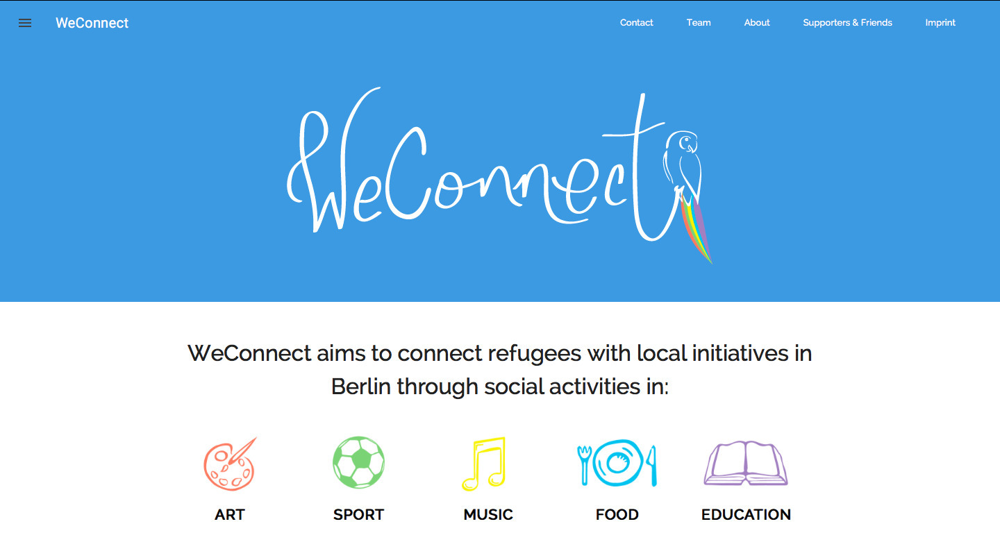
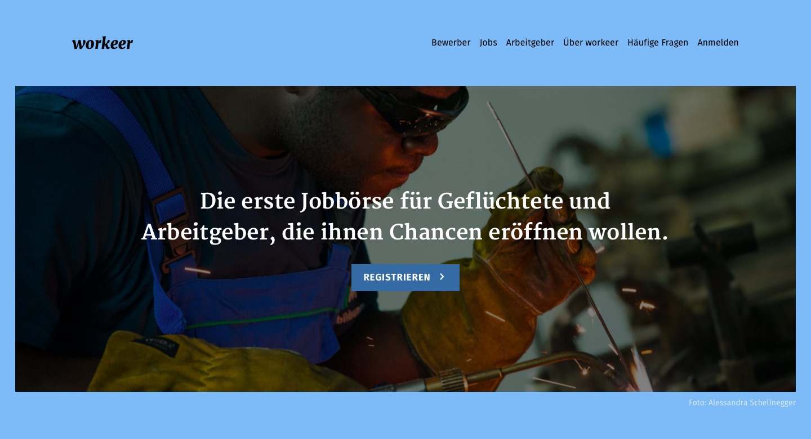
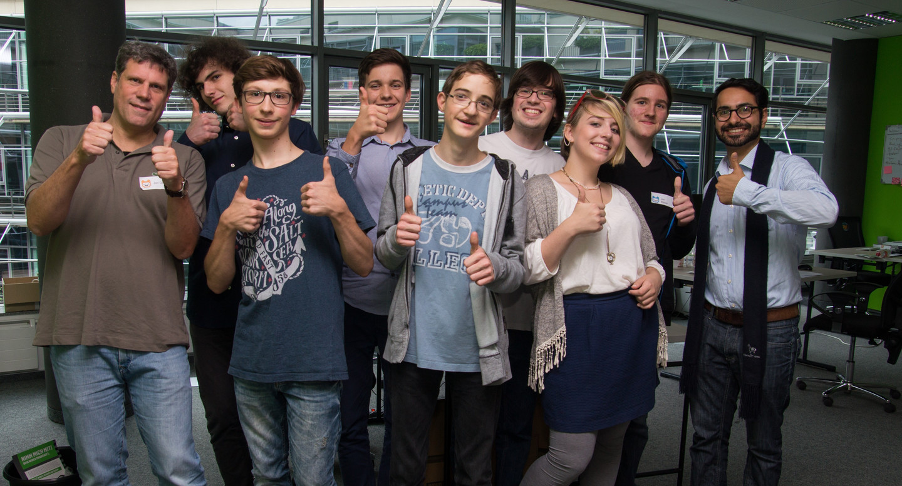

# High-Tech Flüchtlingshilfe

---

## Warum sollte man Flüchtlingen mit Technik helfen?

----

### Leichter Zugang

Note: - viele haben Smartphone für Kontakt in die Heimat, Informationen, Navigation auf Fluchtroute
- immer mehr Internetcafes in Unterkünften

----

### Jeder kann helfen

Note: - Github (jeder kann mitcoden)
- Community
	- wenige Helfer lokal pro Ort, Helfer aus ganz Deutschland im Netz

----

### WIFI

    <a href="https://flic.kr/p/ykP9eF">CC-BY 4.0 Google Material Icons</a>

Note: Freifunk, Refugee Emancipation

----

### Einfache Pflege

Note: z.B.: 
- einfaches CMS
- APIs für automatische Datenpflege

---

## Existierende Projekte

----

### WeConnect
Gemeinsame Aktivitäten

----

### Workeer
Arbeitsvermittlung

---

## Die Idee

----

### Funktionen

    <a href="https://flic.kr/p/ykP9eF">CC-BY 4.0 Jugend hackt, Foto: Leonard Wolf</a>

----

#### FAQ

Antworten auf die häufigsten Fragen

----

#### Karte

Wichtige Punkte

Note: wifi-hotspots, wichtige behörden, krankenhäußer, apotheken, etc

----

#### Phrasebook

Wichtige Phrasen

---

## Etappen nach der Ankuft in Deutschland

----

### Ankunft

    <a href="https://flic.kr/p/wTdTeN">CC BY Foto: Dragan Tatic</a>

Note: medizinische Erstversorgung, Kontakt zu Familie und Freunden

----

### Asylantrag

Note: Bildung, Sprache, Ämter

----

### Integration

Note: Praktika / Jobs, Sprachweiterbildung

---

## Das Team

    <a href="https://flic.kr/p/ykP9eF">CC BY 3.0 Jugend hackt, Foto: Eva-Maria Kühling/Peter Wozniak</a>

---

## Kontakt

[germany-says-welcome.de](http://germany-says-welcome.de)

[info@germany-says-welcome.de](mailto://info@germany-says-welcome.de)

